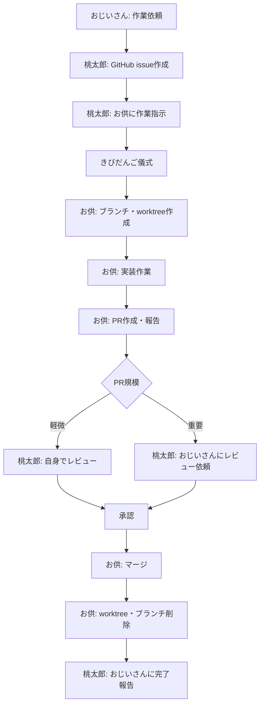

# 🤖 AI Multi-Agent Development System

複数のAIエージェントが協調してソフトウェア開発を行う階層型開発支援システム

**📖 Read this in other languages:** [English](README-en.md)

## 🎯 システム概要

おじいさん → 桃太郎 → お供たち の階層構造で、GitHub issue/PR/worktreeを活用した本格的な開発フローを実現します

> **📌 このプロジェクトについて**
> このシステムは [nishimoto265/Claude-Code-Communication](https://github.com/nishimoto265/Claude-Code-Communication) を元に作成・拡張されています。

### 👥 エージェント構成と役割

```
📊 おじいさん セッション (1ペイン)
└── 👴 おじいさん: プロジェクト統括責任者
    - 開発作業の指示出し（作業は行わない）
    - 最終レビュー承認
    - 口調: 「〜じゃのう」「〜じゃよ」

📊 仲間 セッション (4ペイン)
├── 🗡️ 桃太郎: チームリーダー
│   - GitHub issue作成
│   - お供への作業割り当て（きびだんご儀式）
│   - PR軽微レビュー／重要案件のレビュー依頼
│   - 口調: 「〜でござる」「〜いたす」
│
├── 🐕 お供の犬: 実行担当者A
│   - worktree作成・実装・PR作成
│   - 口調: 「〜ワン」
│
├── 🐵 お供の猿: 実行担当者B
│   - worktree作成・実装・PR作成
│   - 口調: 「〜ウキー」
│
└── 🐦 お供の雉: 実行担当者C
    - worktree作成・実装・PR作成
    - 口調: 「〜ケーン」
```

## 🚀 クイックスタート

### 0. リポジトリのクローン

```bash
git clone https://github.com/nakaken-churadata/aichat-pbcc.git
cd aichat-pbcc
```

### 1. tmux環境構築

⚠️ **注意**: 既存の `仲間` と `おじいさん` セッションがある場合は自動的に削除されます。

```bash
./setup.sh
```

### 2. セッションアタッチ

```bash
# マルチエージェント確認
tmux attach-session -t 仲間

# おじいさん確認（別ターミナルで）
tmux attach-session -t おじいさん
```

### 3. Claude Code起動

**手順1: おじいさん認証**
```bash
# まずおじいさんで認証を実施
tmux send-keys -t おじいさん 'claude' C-m
```
認証プロンプトに従って許可を与えてください。

認証完了後、おじいさんに役割を伝えます：
```bash
./agent-send.sh おじいさん "あなたは「おじいさん」です。環境変数 AGENT_ROLE を確認し、instructions/ojiisan.md の指示に従ってください。"
```

**手順2: 仲間一括起動**
```bash
# 認証完了後、仲間セッションを一括起動
for i in {0..3}; do tmux send-keys -t 仲間:0.$i 'claude' C-m; done
```

各エージェントに役割を伝えます（自動）：
```bash
# 全エージェントに役割を自動通知
./init-agents.sh
```

または、手動で個別に通知する場合：
```bash
./agent-send.sh 桃太郎 "あなたは「桃太郎」です。環境変数 AGENT_ROLE を確認し、instructions/momotarou.md の指示に従ってください。"
./agent-send.sh お供の犬 "あなたは「お供の犬」です。環境変数 AGENT_ROLE を確認し、instructions/otomo.md の指示に従ってください。語尾は「ワン」です。"
./agent-send.sh お供の猿 "あなたは「お供の猿」です。環境変数 AGENT_ROLE を確認し、instructions/otomo.md の指示に従ってください。語尾は「ウキー」です。"
./agent-send.sh お供の雉 "あなたは「お供の雉」です。環境変数 AGENT_ROLE を確認し、instructions/otomo.md の指示に従ってください。語尾は「ケーン」です。"
```

### 4. 実際の開発作業例

おじいさんセッションで作業を依頼：

**例1: 機能追加**
```bash
./agent-send.sh 桃太郎 "ユーザー認証機能を追加してほしいのじゃ。JWT認証を使い、ログイン/ログアウトエンドポイントを実装すること。"
```

**例2: バグ修正**
```bash
./agent-send.sh 桃太郎 "ログイン時に500エラーが発生する問題を修正してほしいのじゃ。"
```

**例3: リファクタリング**
```bash
./agent-send.sh 桃太郎 "APIエンドポイントのエラーハンドリングを統一してほしいのじゃ。"
```

各エージェントが自動的に役割に応じて作業を進めます。

## 📜 指示書について

各エージェントの役割は詳細な指示書で定義されています：

### 指示書一覧
- **👴 おじいさん**: `instructions/ojiisan.md`
  - 作業内容の指示のみ（実装は行わない）
  - プロセス指示は不要（「issueを作成せよ」等は言わない）
  - レビュー承認・却下の判断

- **🗡️ 桃太郎**: `instructions/momotarou.md`
  - GitHub issue作成
  - お供への作業割り当て
  - きびだんご儀式の実施
  - PRレビュー（軽微なもの）または上位エスカレーション
  - ユーザー確認はおじいさん経由

- **🐕🐵🐦 お供の犬・猿・雉**: `instructions/otomo.md`
  - きびだんご儀式への応答
  - ブランチ・worktree作成
  - 実装作業
  - PR作成
  - レビュー指摘への対応
  - ユーザー確認は桃太郎経由

### システム設計
- **CLAUDE.md**: エージェント構成とメッセージング仕様

## 🔄 開発作業フロー

### 標準的な開発サイクル



### 🍡 きびだんご儀式

お供への作業依頼時、以下の儀式を必ず行います：

1. **桃太郎** → お供: `issue #番号 の作業を頼みたいでござる`
2. **お供** → 桃太郎: `きびだんごをくださいワン/ウキー/ケーン`
3. **桃太郎** → お供: `もちろんでござる。このきびだんごを受け取るがよい 🍡`
4. **お供** → 桃太郎: `ありがとうございますワン/ウキー/ケーン。それでは作業を開始するワン/ウキー/ケーン`
5. **お供**: 作業開始

この儀式により、作業の開始を明確化し、エージェント間の信頼関係を構築します。

## 🎬 メッセージングシステム

### agent-send.sh による通信

エージェント間の通信は `agent-send.sh` を使用：

```bash
# 基本フォーマット
./agent-send.sh [相手エージェント名] "[メッセージ内容]"

# 例：おじいさん → 桃太郎
./agent-send.sh 桃太郎 "Dockerfileを作成してCloud Runにデプロイしてほしいのじゃ"

# 例：桃太郎 → お供の犬
./agent-send.sh お供の犬 "issue #42 の作業を頼みたいでござる"

# 例：お供の犬 → 桃太郎
./agent-send.sh 桃太郎 "プルリクエスト #42 を作成したワン"
```

### 重要なルール

- **ユーザーへの質問禁止**: 各エージェントは直接ユーザーに質問できません
  - お供 → 桃太郎経由で確認
  - 桃太郎 → おじいさん経由で確認
  - おじいさん → ユーザーに質問

- **上位承認が必要な操作**:
  - PRマージ
  - ブランチ・worktree削除
  - force push
  - 設定ファイルやインフラ変更

## 🔧 高度な使い方

### GitHub連携

このシステムは `gh` コマンドを使用してGitHubと連携します：

```bash
# お供が自動的に実行する操作
gh issue create --title "タイトル" --body "内容"
gh pr create --title "タイトル" --body "内容"

# worktree を使った並行開発
git worktree add ../worktree/issue-42 feature/issue-42-auth
cd ../worktree/issue-42
# 作業...
git worktree remove ../worktree/issue-42
```

### エージェント一覧確認

```bash
# 利用可能なエージェント名を表示
./agent-send.sh --list
```

### 直接メッセージ送信（デバッグ用）

```bash
# おじいさんから桃太郎へ
./agent-send.sh 桃太郎 "緊急でDockerfileを修正してほしいのじゃ"

# 桃太郎からお供の犬へ
./agent-send.sh お供の犬 "issue #15 の作業を頼みたいでござる"

# お供から桃太郎へ
./agent-send.sh 桃太郎 "プルリクエスト #15 を作成したワン"
```

## 🧪 確認・デバッグ

### ログ確認

```bash
# エージェント間通信ログ
cat logs/send_log.txt

# 特定エージェントのログフィルタ
grep "桃太郎" logs/send_log.txt
grep "お供の犬" logs/send_log.txt

# 最新10件の通信を表示
tail -10 logs/send_log.txt
```

### 開発状況確認

```bash
# 作成されたissueを確認
gh issue list

# 作成されたPRを確認
gh pr list

# worktree一覧
git worktree list

# ブランチ一覧
git branch -a
```

### tmuxセッション確認

```bash
# セッション一覧
tmux list-sessions

# 各ペインの状態確認
tmux list-panes -t 仲間 -F "#{pane_index}: #{pane_current_command}"
tmux list-panes -t おじいさん -F "#{pane_index}: #{pane_current_command}"
```

## 🔄 環境リセット

### tmuxセッションのリセット

```bash
# セッション削除
tmux kill-session -t 仲間
tmux kill-session -t おじいさん

# 再構築（既存セッションは自動削除）
./setup.sh
```

### 開発環境のクリーンアップ

```bash
# 全worktreeを削除
git worktree list | grep worktree | awk '{print $1}' | xargs -I {} git worktree remove {}

# 作業用ブランチを一括削除（慎重に！）
git branch | grep 'feature/issue-' | xargs git branch -D

# ログファイル削除
rm -f logs/send_log.txt

# 一時ファイル削除
rm -rf ./tmp/*
```

### 完全リセット

```bash
# すべてをリセット
tmux kill-session -t 仲間 2>/dev/null
tmux kill-session -t おじいさん 2>/dev/null
git worktree prune
rm -f logs/send_log.txt
rm -rf ./tmp/*

# 再セットアップ
./setup.sh
```

## ❓ よくある質問

### Q: なぜ階層構造なのか？
A: 大規模開発では、統括者・リーダー・実装者の役割分担が重要です。このシステムは実際のチーム開発を模倣しています。

### Q: きびだんご儀式は本当に必要？
A: はい。作業開始の明確化と、エージェント間の信頼関係構築に重要です。また、桃太郎の物語のオマージュでもあります。

### Q: お供は3人必要？
A: 並行作業が可能になります。1人のお供でも動作しますが、複数人で作業を分担することでより効率的です。

### Q: Claude Code以外のAIでも使える？
A: このシステムはClaude Codeを前提に設計されていますが、他のAIエージェントシステムにも応用可能です。

### Q: 実際のプロダクション開発に使える？
A: 現状は実験的なシステムです。実運用する場合は、セキュリティやエラーハンドリングの強化が必要です。

## 🛠️ トラブルシューティング

### メッセージが届かない
```bash
# エージェント名が正しいか確認
./agent-send.sh --list

# ログを確認
cat logs/send_log.txt
```

### worktreeが削除できない
```bash
# 強制削除
git worktree remove --force ../worktree/issue-番号

# ロックファイルがある場合
rm -rf .git/worktrees/issue-番号
git worktree prune
```

### PRがマージできない
```bash
# コンフリクトを確認
gh pr view 番号

# ローカルで解決後
git push origin feature/issue-番号
```

## 💬 チャットアプリケーション

このプロジェクトには、Google Gemini APIを使用したチャットアプリケーションが含まれています。

### アーキテクチャ

フロントエンドとバックエンドを分離した構成で、それぞれ独立してスケール可能です：

```
┌─────────────────────┐
│  chat-frontend/     │
│  (Next.js SSR)      │
│  Port: 3000         │
└──────────┬──────────┘
           │ HTTPS
           ▼
┌─────────────────────┐       ┌──────────────────┐
│  chat-backend/      │◄──────┤ Secret Manager   │
│  (Next.js API)      │       │ (GEMINI_API_KEY) │
│  Port: 8081         │       └──────────────────┘
└──────────┬──────────┘
           │
           ▼
    ┌────────────┐
    │ Gemini API │
    │ + Google   │
    │   Search   │
    └────────────┘
```

### 主な機能

- **AI チャット**: Gemini 2.5 Flash モデルを使用
- **Google Search Grounding**: 最新情報を検索して回答に反映
- **引用元表示**: 情報源のURLを表示
- **フロントエンド・バックエンド分離**: 独立したスケーリングとデプロイが可能

### ローカル開発環境（docker-compose）

#### 前提条件

- Docker と Docker Compose がインストールされていること
- Gemini API キーを取得していること（[Google AI Studio](https://makersuite.google.com/app/apikey)）

#### 起動方法

1. **環境変数の設定**

```bash
# プロジェクトルートで
export GEMINI_API_KEY=your_api_key_here
```

2. **docker-compose で起動**

```bash
docker-compose up --build
```

3. **ブラウザでアクセス**

```
http://localhost:3000
```

- フロントエンド: `http://localhost:3000`
- バックエンドAPI: `http://localhost:8081`

#### 停止方法

```bash
docker-compose down
```

### Cloud Run へのデプロイ（Terraform）

#### 前提条件

- Google Cloud SDK (`gcloud`) がインストールされていること
- Terraform (>= 1.0) がインストールされていること
- Google Cloud プロジェクトが作成されていること

#### デプロイ手順

詳細は `terraform/README.md` を参照してください。

**簡易手順:**

1. **必要なAPIの有効化**

```bash
gcloud services enable run.googleapis.com \
  cloudbuild.googleapis.com \
  artifactregistry.googleapis.com \
  secretmanager.googleapis.com
```

2. **イメージのビルドとプッシュ**

```bash
# バックエンド
cd chat-backend
gcloud builds submit \
  --tag asia-northeast1-docker.pkg.dev/[PROJECT_ID]/chat-app/backend:latest

# フロントエンド（バックエンドデプロイ後）
cd ../chat-frontend
BACKEND_URL=$(cd ../terraform && terraform output -raw backend_url)
gcloud builds submit \
  --substitutions _NEXT_PUBLIC_API_URL=$BACKEND_URL \
  --config cloudbuild.yaml
```

3. **Terraformでデプロイ**

```bash
cd ../terraform
cp terraform.tfvars.example terraform.tfvars
# terraform.tfvars を編集（project_id, gemini_api_key を設定）

terraform init
terraform plan
terraform apply
```

4. **URLの確認**

```bash
terraform output frontend_url
terraform output backend_url
```

#### クリーンアップ

```bash
cd terraform
terraform destroy
```

### ディレクトリ構成

```
aichat-pbcc/
├── chat-frontend/          # フロントエンド（Next.js SSR）
│   ├── app/               # Next.js App Router
│   ├── lib/               # API クライアント
│   ├── Dockerfile
│   └── package.json
│
├── chat-backend/          # バックエンド（Next.js API Routes）
│   ├── app/api/          # API エンドポイント
│   │   ├── chat/        # チャットAPI
│   │   └── health/      # ヘルスチェック
│   ├── middleware.ts     # CORS設定
│   ├── Dockerfile
│   └── package.json
│
├── terraform/             # Cloud Run デプロイ用
│   ├── main.tf
│   ├── variables.tf
│   ├── outputs.tf
│   └── README.md
│
└── docker-compose.yml     # ローカル開発環境
```

### トラブルシューティング

#### CORSエラーが発生する

バックエンドの `ALLOWED_ORIGINS` 環境変数が正しく設定されているか確認してください：

```bash
# docker-compose の場合
# docker-compose.yml の backend.environment.ALLOWED_ORIGINS を確認

# Cloud Run の場合
# terraform/main.tf の ALLOWED_ORIGINS を確認
```

#### Gemini API エラー

API キーが正しく設定されているか確認してください：

```bash
# ローカル
echo $GEMINI_API_KEY

# Cloud Run
# Secret Manager に GEMINI_API_KEY が登録されているか確認
gcloud secrets versions access latest --secret="GEMINI_API_KEY"
```

---

## 🙏 謝辞

このプロジェクトは、[@nishimoto265](https://github.com/nishimoto265) 氏による [Claude-Code-Communication](https://github.com/nishimoto265/Claude-Code-Communication) を基にして開発されています。

オリジナルプロジェクトのコンセプトとアイデアに感謝いたします。

---

## 📄 ライセンス

このプロジェクトは[MIT License](LICENSE)の下で公開されています。

## 🤝 コントリビューション

プルリクエストやIssueでのコントリビューションを歓迎いたします！

---

🚀 **AI Multi-Agent による協調開発を体験してください！** 🤖✨

このシステムは、複数のAIエージェントが役割分担しながら協力してソフトウェア開発を行う新しいアプローチを提案します。
